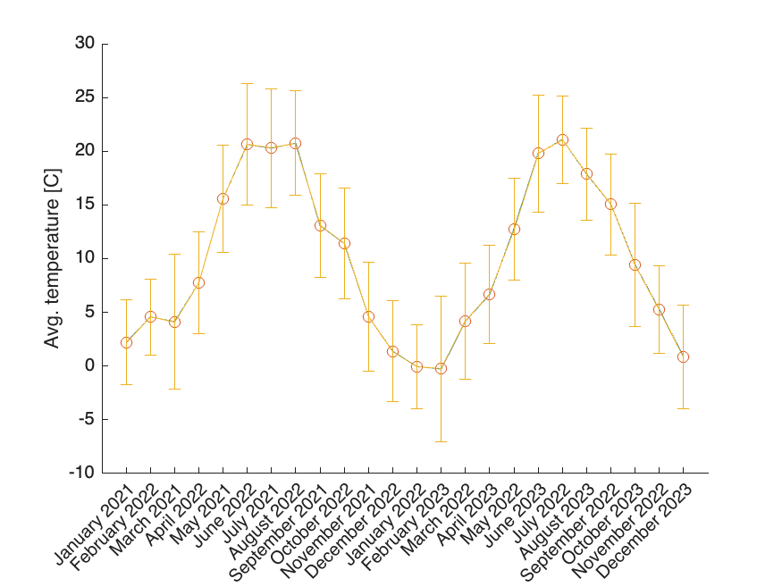
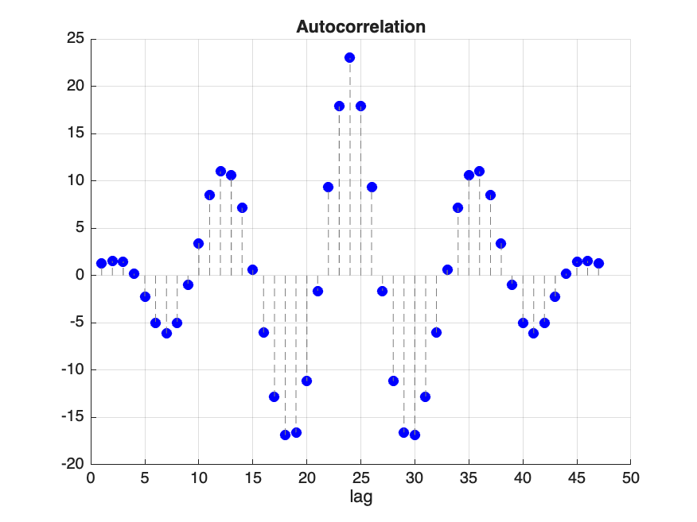

# Opracowanie wyników

> Igor Krzywda, 275480

## Wykres temperatur średnich na miesiąc wraz z odchyleniem standardowym

Na pierwszy rzut oka widać, że temperatury zachowują się podobnie na przestrzeni jednego roku. Maksimum średniej temperatury z lat 2021-2022 to 21.1 stopni Celsjusza, a minimum to -0.27.

## Autokorelacja średnich miesięcznych temperatur

Wykres autokorelacji jest zbliżony kształtem do funkcji sinus, co wskazuje na okresowość wartości temperatur w czasie, co również widać na wykresie temperatur dla każdego miesiąca.

## Histogramy dla wszystkich pomiarów temperatur

Najwięcej pomiarów temperatur przypada na zakres $[0-8)^{\circ}C$

## Histogram dla średnich dobowych temperatur

Z powyższego histogramu widać, że przez około 7 miesięcy temperatura nie przekraczała 10 stopni Celsjusza. Możemy również zauważyć, że mieliśmy 3 doby ze średnią temperaturą między 25 a 30 stopniami.
